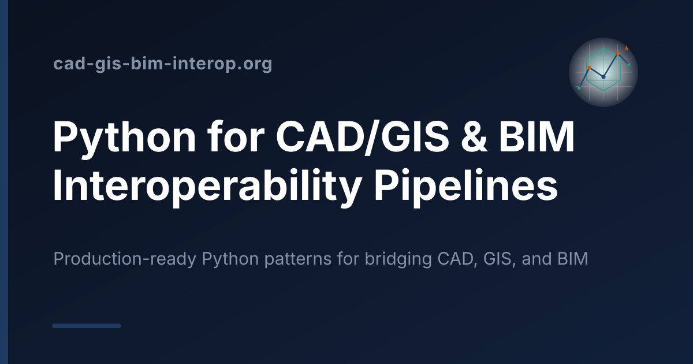

<p align="center">
  <a href="https://www.cad-gis-bim-interop.org">
    
  </a>
</p>

<h1 align="center">Python for CAD/GIS &amp; BIM Interoperability Pipelines</h1>

<p align="center">
  Production-ready Python patterns for building automated interoperability pipelines
  between <strong>CAD</strong>, <strong>GIS</strong>, and <strong>BIM</strong> systems —
  bridging proprietary spatial formats and open geospatial standards without lossy guesswork.
</p>

<p align="center">
  <a href="https://www.cad-gis-bim-interop.org"></a>
  
  
</p>

<p align="center">
  <strong><a href="https://www.cad-gis-bim-interop.org">→ Read the site</a></strong>
</p>

---

## What this is

A deep, engineer-focused reference for shipping reliable **CAD ↔ GIS ↔ BIM** data
pipelines in Python. Every page is written for AEC tech engineers, GIS/CAD integrators,
and infrastructure platform teams who need production behaviour — not toy examples:
runnable scripts with pinned library versions, named failure modes, compatibility
matrices, and hand-authored diagrams — in a light and a dark theme.

It covers DXF/DWG parsing, IFC integration, coordinate transformation, attribute
mapping, batch conversion, quality control, and automation — the unglamorous
engineering that decides whether a digital-twin ingest job silently drops 40% of a
model or lands every asset in the right place.

## Explore the site

- **[Python Parsing &amp; Geometry Extraction](https://www.cad-gis-bim-interop.org/python-parsing-geometry-extraction/)** — `ezdxf`, `ifcopenshell`, pyDWG, mesh conversion, point clouds, and Revit export paths: ingesting design and survey data into clean, queryable geometric primitives.
- **[Coordinate Transformation &amp; Spatial Alignment](https://www.cad-gis-bim-interop.org/coordinate-transformation-spatial-alignment/)** — CRS normalization, unit conversion, vertical datums, layer mapping, and scale/rotation synchronization for survey-grade alignment.
- **[Core Format Fundamentals &amp; Schema Mapping](https://www.cad-gis-bim-interop.org/core-format-fundamentals-schema-mapping/)** — DXF entity structure, DWG limitations, IFC4x3 schema mapping, CityGML interchange, and metadata extraction.
- **[Interoperability Decision Guides](https://www.cad-gis-bim-interop.org/interoperability-decision-guides/)** — choosing between `ezdxf`, pyDWG, and ODA; DXF vs IFC for GIS ingestion; GeoPackage vs PostGIS for CAD output; Shapely vs trimesh vs OpenCASCADE for the geometry in between.

## Built with

- **[Eleventy (11ty)](https://www.11ty.dev/)** — static site generator (Nunjucks + Markdown).
- **Cloudflare Workers** — static asset hosting and edge delivery.
- Hand-authored inline SVG diagrams, structured data (JSON-LD), and a PWA manifest with an offline service worker.

## Local development

```bash
npm install      # install dependencies
npm start        # serve locally with live reload (http://localhost:8080)
npm run build    # production build into _site/
npm run deploy   # build and deploy to Cloudflare
```

## Contributing

Issues and pull requests that improve technical accuracy, add worked examples, or
cover new interoperability edge cases are welcome. Please keep code Python 3.9+
compatible and pin library versions in comments (e.g. `# ezdxf>=1.1.0`).

---

<p align="center"><sub>Bridging CAD, GIS, and BIM — one reliable pipeline at a time.</sub></p>
