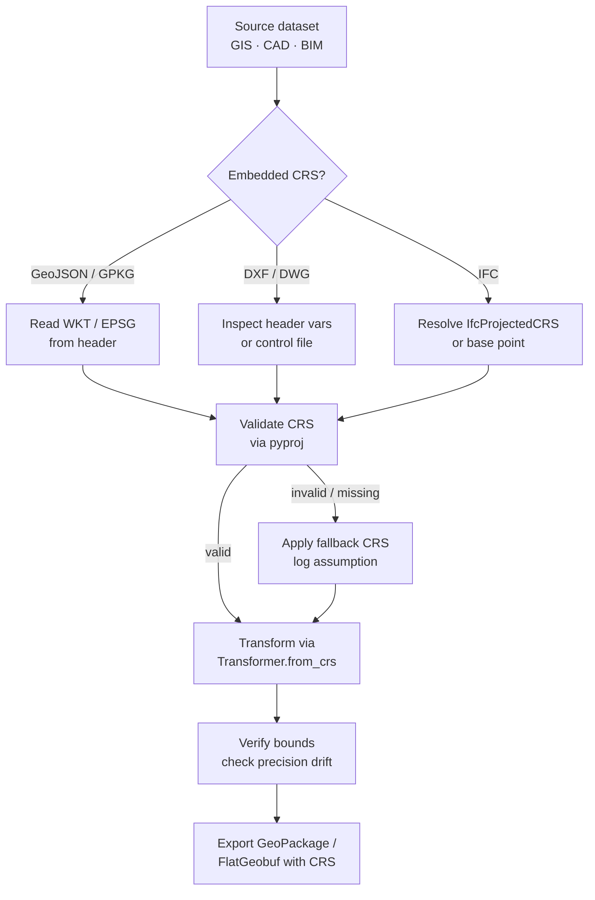

# CRS Normalization Workflows: Python Pipelines for CAD/GIS & BIM Interoperability

In modern infrastructure and built-environment projects, spatial data rarely arrives in a unified coordinate reference system. CAD deliverables frequently use arbitrary local grids or assumed origins, GIS datasets rely on regional projected systems, and BIM models may embed survey control points or default to building-centric coordinates. Without systematic alignment, downstream analytics, clash detection, and geospatial integration fail silently or produce geometrically distorted results. **CRS Normalization Workflows** provide the deterministic, repeatable pipeline required to ingest heterogeneous spatial assets, resolve datum and projection ambiguities, and output a single, validated coordinate baseline.

This workflow sits at the foundation of [Coordinate Transformation & Spatial Alignment](/coordinate-transformation-spatial-alignment/) strategies, serving as the mandatory preprocessing stage before any geometric analysis, asset registration, or federated model assembly can proceed. When executed correctly, normalization eliminates spatial drift, standardizes units, and establishes a reliable geospatial anchor for multi-disciplinary collaboration.

## Prerequisites & Environment Setup

A robust normalization pipeline requires a controlled Python environment with explicit version pinning for geospatial libraries. Coordinate transformations are highly sensitive to underlying C libraries, particularly PROJ, which handles datum shifts, grid files, and ellipsoid definitions. Mixing library versions or relying on system-wide installations frequently introduces subtle transformation inaccuracies that compound across large project extents.

**Core Dependencies:**
- Python 3.9+ (3.10+ recommended for improved type hinting and `pyproj` compatibility)
- `pyproj>=3.4.0` (CRS parsing, transformation engine, and grid management)
- `geopandas>=1.0.0` (vectorized spatial I/O, CRS assignment, and geometry operations)
- `shapely>=2.0.0` (geometry validation, topology checks, and coordinate manipulation)
- `ezdxf` or `ifcopenshell` (CAD/BIM parsing, selected by source format)
- `numpy` & `pandas` (numerical operations, metadata tracking, and batch processing)

Before implementing transformation logic, verify your environment resolves PROJ data paths correctly. Misconfigured `PROJ_LIB` or `PROJ_DATA` environment variables frequently cause silent fallbacks to approximate transformations instead of grid-shifted, survey-grade results. Consult the official [PROJ documentation](https://proj.org/) for platform-specific installation guidance, conda environment best practices, and grid file management.

## Step-by-Step Normalization Pipeline

A production-grade CRS normalization pipeline follows a strict sequence: detection, validation, transformation, and post-normalization verification. Skipping validation steps introduces cumulative spatial drift that compromises downstream [Scale and Rotation Synchronization](/coordinate-transformation-spatial-alignment/scale-and-rotation-synchronization/) efforts. The following workflow ensures deterministic behavior across mixed-format inputs.



### 1. Ingest & CRS Detection

Parse incoming datasets and extract embedded CRS metadata. The extraction strategy varies significantly by format:
- **GIS formats** (GeoJSON, Shapefile, GPKG, GeoPackage) typically embed WKT strings or EPSG identifiers directly in headers or sidecar files (`.prj`).
- **CAD files** (DWG/DXF) rarely contain explicit EPSG codes. Instead, they store survey parameters in headers, rely on external control files, or assume a local `(0,0,0)` origin. For detailed handling of these scenarios, refer to [Converting CAD local coordinates to EPSG:4326](/coordinate-transformation-spatial-alignment/crs-normalization-workflows/converting-cad-local-coordinates-to-epsg4326/).
- **BIM models** (IFC) may reference `IfcProjectedCRS` entities or default to `IfcLocalPlacement` relative to a project base point.

```python
import geopandas as gpd
from pyproj import CRS

def detect_crs_from_metadata(source_path: str, format_type: str) -> CRS | None:
    """Extract CRS from format-specific metadata."""
    if format_type == "gis":
        gdf = gpd.read_file(source_path)
        return gdf.crs
    elif format_type == "cad":
        # DXF parsing requires external control file or manual EPSG assignment
        # Fallback to None to trigger validation step
        return None
    elif format_type == "bim":
        # IFC parsing via ifcopenshell requires entity traversal
        return None
    return None
```

### 2. Validation & Fallback Handling

Cross-reference detected CRS strings against the [EPSG Registry](https://epsg.org/) to confirm validity. Many legacy projects use deprecated codes, custom WKT definitions, or non-standard naming conventions. The validation stage must flag ambiguous references, resolve deprecated EPSG codes to current equivalents, and enforce strict WKT parsing to prevent silent projection mismatches.

When a source lacks explicit metadata, implement a controlled fallback strategy:
1. Query project documentation or survey control logs.
2. Apply a conservative default (e.g., `EPSG:4326` for global baselines or a regional UTM zone).
3. Log the assumption explicitly in the transformation manifest for auditability.

```python
from pyproj import CRS

def validate_and_resolve_crs(raw_crs: str | None, fallback: str = "EPSG:4326") -> CRS:
    """Validate CRS string and resolve to a pyproj CRS object."""
    if raw_crs is None:
        print(f"[WARN] No CRS detected. Applying fallback: {fallback}")
        return CRS.from_string(fallback)

    try:
        resolved = CRS.from_string(raw_crs)
        if not resolved.is_valid:
            raise ValueError("Invalid CRS definition")
        return resolved
    except Exception as e:
        print(f"[ERROR] CRS resolution failed: {e}")
        return CRS.from_string(fallback)
```

### 3. Transformation & Datum Alignment

Core transformation logic relies on `pyproj.Transformer` to handle coordinate conversion, grid shifts, and 3D/2D axis ordering. Always use `always_xy=True` to prevent latitude/longitude inversion, and explicitly request grid-based transformations when working with regional datums (e.g., NAD27 to NAD83, ETRS89 to WGS84).

```python
import geopandas as gpd
from pyproj import CRS, Transformer

def build_transformer(source_crs: CRS, target_crs: CRS, allow_approx: bool = False) -> Transformer:
    """Create a deterministic coordinate transformer."""
    return Transformer.from_crs(
        source_crs,
        target_crs,
        always_xy=True,
        allow_approx=allow_approx
    )

def normalize_geometries(gdf: gpd.GeoDataFrame, target_crs: str) -> gpd.GeoDataFrame:
    """Apply CRS transformation and enforce 2D/3D consistency."""
    target = CRS.from_string(target_crs)
    if gdf.crs is None:
        raise ValueError("GeoDataFrame lacks source CRS. Assign before transforming.")
    return gdf.to_crs(target)
```

During this phase, monitor for vertical datum mismatches. If your pipeline ingests LiDAR point clouds or BIM elevation data alongside 2D GIS vectors, ensure the target CRS includes a vertical component (e.g., `EPSG:7844` or compound CRS definitions). Misaligned vertical datums frequently cause clash detection false positives in infrastructure modeling.

### 4. Post-Transformation Verification & Export

After transformation, validate the output geometry and coordinate ranges. Check for:
- **Coordinate bounds:** Verify values fall within expected regional extents.
- **Topology integrity:** Ensure no self-intersections or collapsed polygons resulted from projection distortion.
- **Unit consistency:** Confirm meters/feet alignment matches project specifications.

Export normalized data to a standardized, lossless format like GeoPackage (`.gpkg`) or FlatGeobuf (`.fgb`). These formats preserve CRS metadata natively and support spatial indexing for downstream queries. Properly structured exports also simplify subsequent [Layer Mapping Logic](/coordinate-transformation-spatial-alignment/layer-mapping-logic/) implementation, ensuring semantic attributes align with spatial features.

```python
import geopandas as gpd

def verify_and_export(gdf: gpd.GeoDataFrame, output_path: str) -> None:
    """Validate geometry bounds and export to standardized format."""
    if gdf.is_empty.all():
        raise ValueError("Empty geometry after transformation.")

    bounds = gdf.total_bounds
    if any(abs(v) > 1e7 for v in bounds):
        print("[WARN] Extreme coordinate values detected. Verify CRS alignment.")

    gdf.to_file(output_path, driver="GPKG", engine="pyogrio")
    print(f"[INFO] Normalized dataset exported to {output_path}")
```

## Production Hardening & Error Handling

In enterprise environments, normalization pipelines must handle malformed inputs, network timeouts (when fetching grid files), and memory constraints. Implement the following safeguards:

1. **Chunked Processing:** For datasets exceeding available RAM, use `geopandas` chunking or `pyogrio` streaming to process features in batches.
2. **Grid File Caching:** Pre-download required transformation grids (e.g., NADCON, NTv2) and store them in a shared network directory. Set `PROJ_NETWORK=OFF` in isolated environments to prevent runtime fetch failures.
3. **Structured Logging:** Emit JSON-formatted logs capturing source CRS, target CRS, transformation method, grid usage, and any fallback decisions. This enables rapid auditing when spatial discrepancies arise.
4. **Tolerance Thresholds:** Define acceptable deviation limits (e.g., `±0.01m` for survey-grade assets, `±0.5m` for conceptual planning). Flag transformations that exceed thresholds for manual review.

Refer to the official [pyproj documentation](https://pyproj4.github.io/pyproj/stable/) for advanced transformer configuration, including pipeline strings, custom CRS definitions, and performance tuning for bulk coordinate operations.

## Integration with Downstream Pipelines

CRS normalization is not an isolated task; it establishes the spatial baseline for all subsequent data operations. Once coordinates are unified, platform teams can safely execute:
- **Geometric analysis:** Buffering, overlay, and proximity calculations without projection-induced distortion.
- **Asset registration:** Aligning IoT sensor locations, survey markers, and BIM components to a shared geospatial anchor.
- **Federated model assembly:** Merging multi-disciplinary deliverables while preserving spatial relationships and attribute integrity.

By standardizing the coordinate framework early, engineering teams eliminate the need for ad-hoc spatial corrections later in the project lifecycle. This deterministic approach reduces rework, accelerates QA/QC cycles, and ensures compliance with geospatial data standards across distributed project teams.

## Conclusion

Effective **CRS Normalization Workflows** transform fragmented spatial inputs into a reliable, unified coordinate baseline. By enforcing strict validation, leveraging grid-aware transformations, and implementing robust verification steps, Python-based pipelines can handle the complexity of modern CAD, GIS, and BIM interoperability. When integrated with broader spatial alignment strategies, normalization becomes the foundation for accurate analytics, seamless collaboration, and resilient infrastructure data platforms.