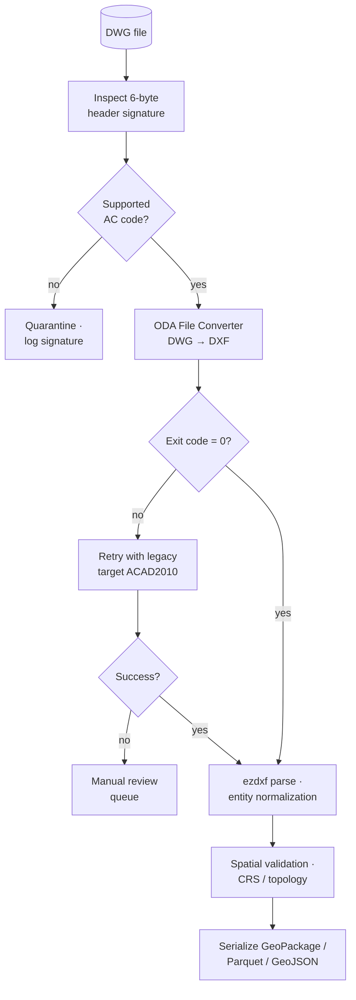

# DWG Proprietary Limitations in Python Interoperability Pipelines

The DWG format remains the de facto exchange standard across architecture, engineering, and construction (AEC) workflows, yet its closed binary architecture introduces persistent friction for automated pipelines. Unlike open, schema-driven formats, DWG relies on undocumented binary structures, version-specific serialization, and proprietary object dictionaries. For Python automation builders and infrastructure platform teams, these **DWG proprietary limitations** dictate strict architectural boundaries around ingestion, validation, and downstream schema mapping.

This guide outlines a production-ready workflow for navigating DWG constraints in Python-based CAD/GIS/BIM pipelines. It covers environment prerequisites, step-by-step routing logic, tested code patterns, and systematic error resolution strategies. For foundational context on format normalization and spatial data alignment, review the [Core Format Fundamentals & Schema Mapping](/core-format-fundamentals-schema-mapping/) documentation before implementing the patterns below.

## Environment Prerequisites & Dependency Isolation

Before integrating DWG ingestion into a Python pipeline, establish a controlled environment that isolates proprietary conversion tooling from open-source spatial libraries. Mixing compiled CAD binaries with pure-Python geospatial stacks frequently causes dependency conflicts, especially when dealing with C-extensions like `fiona` or `pyproj`.

1. **Python 3.9+** with `venv` or `conda` for strict dependency isolation
2. **ODA File Converter CLI** for headless DWG-to-DXF/IFC routing
3. **`ezdxf`** for DXF parsing, entity traversal, and coordinate extraction
4. **`shapely`** and `geopandas` for spatial validation, topology checks, and CRS alignment
5. **`pydantic`** or `dataclasses` for strict schema validation and type enforcement
6. **Structured logging** (`structlog` or standard `logging`) for pipeline observability and audit trails

Licensing constraints are a primary consideration. The DWG specification is controlled by Autodesk, and direct binary parsing requires either an official SDK license or reliance on reverse-engineered libraries that carry legal and stability risks. The Open Design Alliance (ODA) provides a legally compliant, widely adopted alternative for enterprise pipelines. Consult the official [ODA File Converter documentation](https://www.opendesign.com/guestfiles/oda_file_converter) for deployment guidelines, CLI flags, and commercial licensing terms.

## Production-Ready Ingestion Workflow

A resilient pipeline must treat DWG as an opaque container rather than a directly queryable database. The following workflow standardizes ingestion while respecting format boundaries and minimizing silent data loss.



> **Warning:** Never embed proprietary ODA/Teigha binaries in public container images. Build a thin internal base image with the licensed converter and pin worker pools to it; mount only inputs/outputs at runtime.

### 1. Binary Header Inspection & Version Detection

DWG files embed a 6-byte header signature indicating the release version (e.g., `AC1032` for AutoCAD 2018, `AC1027` for AutoCAD 2013). Parsing this signature before attempting extraction prevents silent corruption and routing failures. Version mismatches are the most common failure point in automated ingestion, particularly when legacy files enter modern CI/CD pipelines.

```python
from pathlib import Path

DWG_VERSION_MAP = {
    b"AC1032": "2018",
    b"AC1027": "2013",
    b"AC1024": "2010",
    b"AC1021": "2007",
    b"AC1018": "2004",
}

def detect_dwg_version(file_path: Path) -> str:
    with open(file_path, "rb") as f:
        header = f.read(6)
    version = DWG_VERSION_MAP.get(header, "unknown")
    if version == "unknown":
        raise ValueError(f"Unrecognized DWG binary signature: {header.hex()}")
    return version
```

Binary parsing at this stage should strictly use Python's built-in `struct` module or raw byte slicing to avoid loading heavy CAD libraries prematurely. For a comprehensive breakdown of how version headers map to internal object serialization rules, see [Understanding DWG version compatibility](/core-format-fundamentals-schema-mapping/dwg-proprietary-limitations/understanding-dwg-version-compatibility/).

### 2. Headless Conversion Routing

Direct DWG parsing in Python is unstable across versions and highly susceptible to proxy object corruption. Route files through a headless converter to produce DXF (for 2D/3D geometry) or IFC (for BIM metadata). The ODA CLI supports batch processing and preserves layer hierarchies, blocks, and extended entity data when configured correctly.

```python
import logging
import subprocess
from pathlib import Path

def convert_dwg_to_dxf(dwg_path: Path, output_dir: Path, cli_path: str = "ODAFileConverter") -> Path:
    output_dir.mkdir(parents=True, exist_ok=True)
    cmd = [
        cli_path,
        str(dwg_path.parent),
        str(output_dir),
        "DXF",
        "ACAD2018",
        "0",
        "1"
    ]
    result = subprocess.run(cmd, capture_output=True, text=True, check=False)
    if result.returncode != 0:
        logging.error(f"Conversion failed: {result.stderr}")
        raise RuntimeError("Headless conversion exited with non-zero status")
    return output_dir / f"{dwg_path.stem}.dxf"
```

Always pin the target DXF version to a stable release (e.g., `ACAD2018` or `ACAD2013`) rather than matching the source DWG version. This reduces parser fragmentation downstream and aligns with modern `ezdxf` compatibility matrices.

### 3. DXF Parsing & Entity Normalization

Once converted, DXF files can be safely ingested using open-source libraries. The DXF format exposes geometric primitives, layer assignments, and coordinate systems in a text-based or binary structure that Python can traverse deterministically. However, raw DXF output often contains redundant blocks, exploded proxies, and inconsistent units.

```python
from pathlib import Path
from typing import List

import ezdxf
from pydantic import BaseModel, Field

class NormalizedEntity(BaseModel):
    layer: str
    entity_type: str
    coordinates: List[tuple[float, float, float]]
    metadata: dict = Field(default_factory=dict)

def parse_dxf_entities(dxf_path: Path) -> List[NormalizedEntity]:
    doc = ezdxf.readfile(str(dxf_path))
    msp = doc.modelspace()
    entities = []
    
    for entity in msp:
        if entity.dxftype() in ("LINE", "CIRCLE", "LWPOLYLINE", "INSERT"):
            coords = []
            if hasattr(entity, "dxf"):
                if hasattr(entity.dxf, "center"):
                    coords = [(entity.dxf.center.x, entity.dxf.center.y, entity.dxf.center.z)]
                elif hasattr(entity, "vertices"):
                    coords = [(v.x, v.y, v.z) for v in entity.vertices]
                elif hasattr(entity.dxf, "start"):
                    coords = [
                        (entity.dxf.start.x, entity.dxf.start.y, entity.dxf.start.z),
                        (entity.dxf.end.x, entity.dxf.end.y, entity.dxf.end.z)
                    ]
            entities.append(NormalizedEntity(
                layer=entity.dxf.layer if hasattr(entity.dxf, "layer") else "0",
                entity_type=entity.dxftype(),
                coordinates=coords
            ))
    return entities
```

Normalization at this stage prevents schema drift when mapping CAD primitives to spatial databases. For a detailed reference on how DXF primitives map to standardized spatial objects and attribute tables, consult the [DXF Entity Structure Breakdown](/core-format-fundamentals-schema-mapping/dxf-entity-structure-breakdown/).

### 4. Spatial Validation & Target Schema Mapping

Raw CAD coordinates rarely align with real-world geospatial reference systems. Before committing data to a GIS or BIM platform, validate topology, enforce CRS transformations, and map attributes to a strict schema.

```python
import logging
from typing import List

import geopandas as gpd
from shapely.geometry import LineString, Point, Polygon
from shapely.validation import make_valid

# `NormalizedEntity` is the Pydantic model defined in the previous block.

def build_geodataframe(entities: List[NormalizedEntity], target_crs: str = "EPSG:4326") -> gpd.GeoDataFrame:
    geometries = []
    attributes = []
    
    for ent in entities:
        if not ent.coordinates:
            continue
        try:
            if len(ent.coordinates) == 1:
                geom = Point(ent.coordinates[0])
            elif len(ent.coordinates) == 2:
                geom = LineString(ent.coordinates)
            else:
                geom = Polygon(ent.coordinates)
            geom = make_valid(geom)
            geometries.append(geom)
            attributes.append({"layer": ent.layer, "type": ent.entity_type})
        except Exception as e:
            logging.warning(f"Invalid geometry skipped: {e}")
            
    gdf = gpd.GeoDataFrame(attributes, geometry=geometries, crs="EPSG:32633")
    return gdf.to_crs(target_crs)
```

Coordinate transformation and schema enforcement should occur before any downstream export. When targeting BIM interoperability, map normalized CAD layers to IFC classes and property sets. The [IFC4x3 Schema Mapping](/core-format-fundamentals-schema-mapping/ifc4x3-schema-mapping/) reference provides exact class equivalencies and attribute translation rules for AEC data pipelines.

## Error Resolution & Fallback Architecture

Automated DWG ingestion will inevitably encounter malformed files, missing fonts, or unsupported proxy objects. Implement a tiered fallback strategy to maintain pipeline uptime:

1. **Header Validation Failure:** Immediately quarantine the file. Do not attempt conversion. Log the binary signature and trigger an alert for manual review.
2. **Conversion Timeout/Exit Code > 0:** Retry with a legacy DXF target (e.g., `ACAD2010`). If it fails again, route to a manual processing queue and preserve the original DWG for audit.
3. **Geometry Corruption Post-Parsing:** Use `shapely.make_valid()` to repair self-intersecting polygons or collapsed lines. If validation fails, extract only metadata and layer assignments, flagging the geometry as `invalid` in the output schema.
4. **Missing External References (Xrefs):** DWG files frequently reference external drawings. Headless converters typically flatten or ignore Xrefs. Document this limitation in pipeline metadata and enforce a pre-ingestion Xref binding policy at the CAD authoring stage.

Implement circuit breakers around conversion steps. If failure rates exceed a defined threshold (e.g., 5% per batch), halt the pipeline and trigger a diagnostic run to isolate version-specific converter bugs.

## Observability & Deployment Considerations

Production pipelines require deterministic logging, memory management, and compliance tracking. DWG files can range from a few megabytes to over 500 MB, and headless conversion is CPU-intensive.

- **Structured Logging:** Emit JSON-formatted logs capturing file size, detected version, conversion duration, entity count, and validation status. Use correlation IDs to trace files across conversion, parsing, and export stages.
- **Concurrency Limits:** Run ODA CLI instances in isolated worker pools. Limit concurrent conversions to `CPU_CORES - 2` to prevent I/O bottlenecks and memory exhaustion.
- **Licensing Compliance:** Maintain an audit trail of processed DWG files. Ensure your deployment adheres to Autodesk's redistribution policies or ODA's commercial licensing terms. Never embed proprietary SDK binaries in public container images.
- **Containerization:** Package the pipeline using multi-stage Docker builds. Isolate the ODA CLI in a base image, install Python dependencies in a secondary layer, and mount shared volumes for temporary DXF artifacts. Clean up intermediate files immediately after parsing to prevent disk saturation.

## Conclusion

Navigating DWG proprietary limitations requires treating the format as a black box that must be safely converted, validated, and normalized before entering open spatial or BIM ecosystems. By enforcing strict version detection, leveraging headless conversion routing, applying deterministic DXF parsing, and mapping outputs to standardized schemas, infrastructure teams can build resilient, auditable pipelines. The patterns outlined here prioritize stability over direct parsing, ensuring that automated workflows scale reliably across enterprise AEC datasets without compromising legal compliance or data integrity.