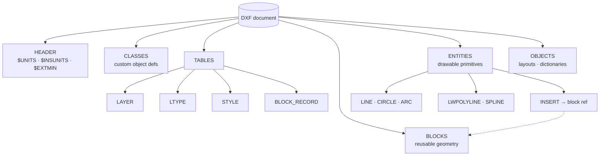

# DXF Entity Structure Breakdown

The Drawing Exchange Format (DXF) remains a foundational interchange standard across AEC, GIS, and infrastructure automation. While modern pipelines increasingly target openBIM standards, DXF persists as the lowest-common-denominator for geometry transfer between heterogeneous platforms. A precise **DXF Entity Structure Breakdown** is essential for engineers building reliable Python-based conversion, validation, and spatial ingestion tools. This guide dissects the format’s internal architecture, provides production-tested parsing workflows, and outlines error-handling patterns for enterprise interoperability pipelines. For broader context on format translation strategies and schema alignment, refer to our [Core Format Fundamentals & Schema Mapping](/core-format-fundamentals-schema-mapping/) documentation.

## Prerequisites

Before implementing the parsing workflows below, ensure your environment meets the following baseline requirements:
- Python 3.9+ with `pip` package management
- `ezdxf` library (v1.1.0+) installed via `pip install ezdxf`
- Familiarity with CAD coordinate systems (WCS, OCS, ECS) and spatial reference concepts
- Understanding of ASCII vs. binary DXF encoding differences
- Access to representative DXF exports (R2013–R2024 recommended for modern entity support)
- Basic knowledge of group code taxonomy (integer identifiers paired with values)

## Architectural Layout

DXF is a tagged-text format organized into strictly delineated sections. Each drawing object is defined by a sequence of group codes, where the integer identifier dictates the data type and semantic meaning of the subsequent value. The format follows a hierarchical layout:

1. **HEADER**: Global drawing variables (`$UNITS`, `$LIMMIN`, `$INSUNITS`, `$HANDSEED`)
2. **CLASSES**: Custom object definitions (rarely utilized in standard CAD exports)
3. **TABLES**: Symbol tables for reusable definitions (`LAYER`, `LTYPE`, `STYLE`, `DIMSTYLE`, `UCS`, `BLOCK_RECORD`, `VIEWPORT`)
4. **BLOCKS**: Reusable geometry containers with attribute definitions
5. **ENTITIES**: Primary drawable objects (`LINE`, `CIRCLE`, `LWPOLYLINE`, `SPLINE`, `TEXT`, `INSERT`, `HATCH`)
6. **OBJECTS**: Non-graphical data structures (layouts, dictionaries, `XRECORD`, `MATERIAL`)



Unlike proprietary formats such as DWG, DXF exposes its schema transparently, though this comes at the cost of file size and parsing overhead. Understanding these [DWG Proprietary Limitations](/core-format-fundamentals-schema-mapping/dwg-proprietary-limitations/) clarifies why DXF remains the preferred interchange medium for cross-platform automation despite its verbosity. The explicit tag-value pairing eliminates the need for reverse-engineered binary offsets, making it highly suitable for deterministic parsing in CI/CD validation pipelines.

## Group Code Taxonomy & Entity Anatomy

Group codes are the atomic units of DXF serialization. They are categorized by numeric ranges that enforce strict typing:

| Group Code Range | Data Type | Typical Usage |
|------------------|-----------|---------------|
| `0–9` | String | Entity/class names, text values, handles |
| `10–59` | Real / Double | Primary coordinates, scale factors, angles |
| `60–79` | Integer | Visibility flags, color indices, line weights |
| `90–99` | 32-bit Integer | Counters, custom object IDs |
| `100–109` | String | Subclass markers (e.g., `AcDbLine`, `AcDbCircle`) |
| `140–149` | Real | Dimension variables, system constants |
| `210–239` | Real | Extrusion direction vectors (OCS alignment) |

A single entity in the `ENTITIES` section typically spans 10–40 lines of ASCII text. For example, a `LINE` entity begins with `0 LINE`, followed by a subclass marker `100 AcDbEntity`, layer assignment `8 <layer_name>`, and coordinate pairs `10/20/30` (start) and `11/21/31` (end). The official [Autodesk DXF Reference](https://help.autodesk.com/view/OARX/2024/ENU/?guid=GUID-235B22E0-A567-4CF6-92D3-38A2306D73F3) maintains the definitive mapping of these codes across AutoCAD releases.

Parsing these sequences manually is error-prone due to optional codes, legacy version drift, and malformed exports. Production systems should rely on validated parsers that normalize group codes into structured objects while preserving raw fallback data for audit trails.

## Production-Grade Parsing Workflow

The `ezdxf` library abstracts the low-level group code iteration into a robust object model. Below is a production-ready pattern for extracting geometric primitives while enforcing strict validation and graceful degradation.

```python
import logging
from typing import Any, Dict, List

import ezdxf

logging.basicConfig(level=logging.WARNING)

def extract_entities_safe(filepath: str) -> List[Dict[str, Any]]:
    """Parse DXF entities with strict type checking and error isolation."""
    try:
        doc = ezdxf.readfile(filepath)
    except (ezdxf.DXFStructureError, IOError) as e:
        logging.error(f"Failed to load DXF structure: {e}")
        return []
    
    msp = doc.modelspace()
    valid_entities = []
    
    for entity in msp:
        try:
            if entity.dxftype() == "LINE":
                valid_entities.append({
                    "type": "LINE",
                    "handle": entity.dxf.handle,
                    "layer": entity.dxf.layer,
                    "start": (entity.dxf.start.x, entity.dxf.start.y, entity.dxf.start.z),
                    "end": (entity.dxf.end.x, entity.dxf.end.y, entity.dxf.end.z)
                })
            elif entity.dxftype() == "CIRCLE":
                valid_entities.append({
                    "type": "CIRCLE",
                    "handle": entity.dxf.handle,
                    "layer": entity.dxf.layer,
                    "center": (entity.dxf.center.x, entity.dxf.center.y, entity.dxf.center.z),
                    "radius": entity.dxf.radius
                })
            elif entity.dxftype() == "LWPOLYLINE":
                valid_entities.append({
                    "type": "LWPOLYLINE",
                    "handle": entity.dxf.handle,
                    "layer": entity.dxf.layer,
                    "vertices": [(v[0], v[1], 0.0) for v in entity.get_points("xy")],
                    "closed": bool(entity.closed)
                })
        except AttributeError as e:
            logging.warning(f"Malformed entity {entity.dxftype()} (Handle: {entity.dxf.handle}): {e}")
            continue
            
    return valid_entities
```

This workflow isolates parsing failures at the entity level, preventing a single corrupted object from terminating the entire ingestion job. For comprehensive API coverage and advanced filtering techniques, consult the [ezdxf official documentation](https://ezdxf.readthedocs.io/en/stable/).

## Coordinate Systems & Spatial Transformation

DXF entities do not inherently store a geographic coordinate reference system (CRS). Instead, they rely on three nested spatial contexts:
- **World Coordinate System (WCS)**: The global Cartesian frame for the drawing.
- **Object Coordinate System (OCS)**: Local frame defined by extrusion vectors (`210`, `220`, `230`), used for planar entities like `HATCH` or `SOLID`.
- **Entity Coordinate System (ECS)**: Legacy term largely superseded by OCS in modern exports.

When integrating DXF into GIS or BIM pipelines, engineers must explicitly map WCS units to real-world coordinates. This often requires applying affine transformations derived from known control points or embedded geolocation tags (`GEOGRAPHICLOCATION` entity). Misaligned OCS extrusion vectors are a frequent source of inverted geometry or flipped normals in downstream rendering engines. Properly resolving these transformations is critical when aligning CAD geometry with [IFC4x3 Schema Mapping](/core-format-fundamentals-schema-mapping/ifc4x3-schema-mapping/) workflows, where spatial consistency dictates clash detection accuracy and quantity takeoff reliability.

## Header Variables & Metadata Extraction

The `HEADER` section acts as the drawing’s configuration manifest. It contains system variables that govern unit scaling, precision, and generation metadata. Key variables for pipeline automation include:

- `$INSUNITS`: Drawing unit definition (1=unitless, 2=inches, 4=mm, 6=meters)
- `$MEASUREMENT`: 0=English, 1=Metric (affects block scaling behavior)
- `$HANDSEED`: Next available entity handle (useful for incremental updates)
- `$ACADVER`: AutoCAD release string (e.g., `AC1032` for R2018)

Parsing these values early in the ingestion pipeline allows you to normalize units before geometry extraction, preventing scale drift in spatial databases. For a step-by-step implementation of header extraction, including fallback logic for missing variables, review our guide on [How to parse DXF headers with Python](/core-format-fundamentals-schema-mapping/dxf-entity-structure-breakdown/how-to-parse-dxf-headers-with-python/).

## Validation & Enterprise Routing Strategies

Enterprise DXF ingestion pipelines must handle version fragmentation, truncated files, and vendor-specific extensions. Implement the following reliability patterns:

1. **Pre-Flight Validation**: Check `$ACADVER` against supported ranges. Reject R12 or earlier exports unless legacy conversion is explicitly enabled.
2. **Chunked Processing**: For files exceeding 500MB, stream entities via `ezdxf`’s iterator rather than loading the full document into memory. Use `doc.modelspace().query()` to filter by type before materialization.
3. **Fallback Conversion Routing**: When encountering unsupported entities (e.g., `ACAD_PROXY_ENTITY` or custom `AECC_*` Civil 3D objects), route them to a quarantine queue with raw group code dumps attached. Trigger a secondary conversion pass using vendor-specific SDKs or heuristic approximation.
4. **Schema Diff Logging**: Generate a manifest of encountered entity types, layer names, and missing group codes. Compare against a baseline schema to detect upstream CAD template drift.

By treating DXF as a structured data stream rather than a static file, platform teams can achieve deterministic ingestion rates, reduce manual QA overhead, and maintain auditability across heterogeneous CAD sources.

## Conclusion

A rigorous **DXF Entity Structure Breakdown** reveals a format that, despite its age, remains highly adaptable to modern automation requirements. By leveraging explicit group code taxonomy, enforcing coordinate system normalization, and implementing resilient parsing workflows, engineering teams can transform legacy CAD exports into reliable spatial datasets. Integrating these patterns into your interoperability stack ensures consistent geometry translation, reduces pipeline failures, and establishes a scalable foundation for cross-platform AEC and GIS operations.