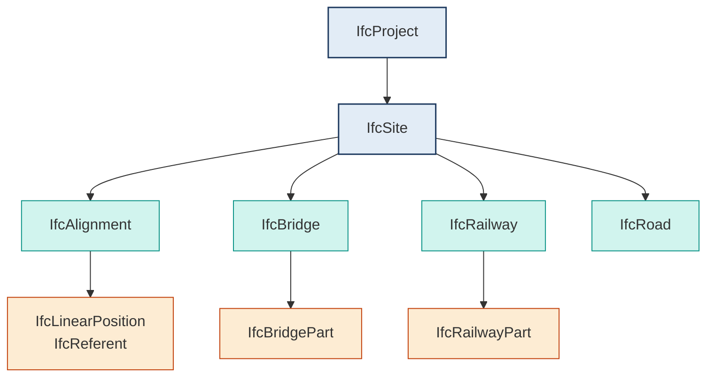

# IFC4x3 Schema Mapping: Python Workflows for BIM-to-GIS Interoperability

The transition from building-centric BIM to infrastructure-scale GIS demands precise, standards-compliant schema translation. **IFC4x3 Schema Mapping** serves as the foundational bridge for civil engineering, rail, port, and road projects, introducing dedicated entities like `IfcAlignment`, `IfcBridge`, and `IfcRailway`. Unlike legacy building-focused releases, IFC4x3 natively supports linear referencing, geospatial coordinate systems, and terrain modeling. For AEC tech engineers and Python automation builders, mastering this schema is critical to building reliable interoperability pipelines that feed digital twins, asset management systems, and spatial analytics platforms.

This guide aligns with the broader [Core Format Fundamentals & Schema Mapping](/core-format-fundamentals-schema-mapping/) framework and delivers a production-tested Python workflow for extracting, transforming, and validating IFC4x3 data. By following the official [buildingSMART IFC4x3 specification](https://standards.buildingsmart.org/IFC/RELEASE/IFC4_3/HTML/), engineers can avoid common translation pitfalls and ensure deterministic data handoffs across heterogeneous platforms.

## Prerequisites & Environment Configuration

Before implementing schema mapping logic, ensure your environment meets these baseline requirements:

- **Python 3.9+** with virtual environment isolation (`venv` or `conda`)
- `ifcopenshell` ≥ 0.8.0 (compiled with IFC4x3 EXPRESS schema support)
- `pandas` ≥ 2.0 for structured property tabulation
- `shapely` ≥ 2.0 and `pyproj` ≥ 3.0 for geometry/CRS handling
- Access to a validated IFC4x3 file (e.g., civil alignment, bridge, or railway model)
- Familiarity with EXPRESS schema inheritance and IFC property set (`Pset_*`) conventions

Install dependencies via:
```bash
pip install ifcopenshell pandas shapely pyproj
```

## Step-by-Step Workflow Architecture

### 1. Schema Validation & Header Ingestion
Load the IFC file and verify the schema version immediately. IFC4x3 files declare `FILE_SCHEMA(('IFC4X3'))` in the STEP header. Early validation prevents downstream mapping failures caused by legacy `IFC2x3` or `IFC4` files that lack civil-specific entities. Parse the header programmatically to confirm schema compliance before allocating memory for entity traversal.

### 2. Entity Hierarchy Traversal & Linear Referencing
Extract root spatial structures (`IfcProject`, `IfcSite`, `IfcAlignment`, `IfcBridge`) and traverse containment relationships via `IsDecomposedBy`. IFC4x3 introduces `IfcLinearPosition` and `IfcReferent` for linear asset tracking, requiring specialized traversal logic that differs significantly from traditional tree-based building hierarchies. While CAD formats like AutoCAD rely on layer-based grouping, understanding the structural differences in [DXF Entity Structure Breakdown](/core-format-fundamentals-schema-mapping/dxf-entity-structure-breakdown/) highlights why EXPRESS-based containment must be resolved through explicit relationship traversal rather than spatial proximity heuristics.

### 3. Property & Quantity Extraction
Map `IfcPropertySet`, `IfcElementQuantity`, and `IfcMaterial` data to flat key-value structures. Civil models heavily utilize `Pset_Alignment*`, `Pset_Railway*`, and `Pset_Bridge*` sets. Normalize naming conventions (camelCase vs. PascalCase) and handle multi-value properties (`IfcPropertyEnumeratedValue`, `IfcPropertyTableValue`) during extraction. For detailed strategies on flattening nested IFC attributes into spatial feature tables, refer to [Mapping IFC properties to GeoJSON attributes](/core-format-fundamentals-schema-mapping/ifc4x3-schema-mapping/mapping-ifc-properties-to-geojson-attributes/).

### 4. Geometry Transformation & CRS Alignment
Convert STEP-based geometry (`IfcShapeRepresentation`) to coordinate arrays or GeoJSON-compatible primitives. Apply `IfcGeometricRepresentationContext` and `IfcProjectedCRS` to transform local survey coordinates to EPSG-compliant spatial references. Unlike proprietary formats where coordinate systems are often embedded in undocumented headers or require manual calibration, the [DWG Proprietary Limitations](/core-format-fundamentals-schema-mapping/dwg-proprietary-limitations/) demonstrate why open schema mapping must explicitly resolve `TrueNorth` and `ProjectNorth` offsets before geospatial export.

### 5. Serialization & Pipeline Export
Structure mapped data into interoperable formats (GeoJSON, Parquet, or relational tables). Validate against target schema constraints before pipeline handoff. Implement chunked serialization for large infrastructure models to prevent memory exhaustion during batch processing.



> **Tip:** Always resolve `IsDecomposedBy` and `ContainsElements` relationships in *both directions* before serializing — parent-only traversal silently drops nested civil components like `IfcAlignmentCant` or `IfcReferent` that sit outside the spatial containment tree.

## Production-Ready Python Implementation

The following pattern demonstrates a robust, memory-efficient approach to IFC4x3 schema mapping. It uses generator-based traversal, explicit CRS resolution, and structured property flattening.

```python
import ifcopenshell
import ifcopenshell.geom
import pandas as pd
import pyproj
from shapely.geometry import mapping
from typing import Generator, Dict, List, Optional
import warnings

def load_and_validate_ifc(filepath: str) -> ifcopenshell.file:
    """Load IFC file and validate IFC4x3 schema declaration."""
    try:
        model = ifcopenshell.open(filepath)
        schema = model.schema
        if schema != "IFC4X3":
            raise ValueError(f"Expected IFC4X3, found {schema}")
        return model
    except Exception as e:
        raise RuntimeError(f"Failed to ingest IFC file: {e}")

def extract_crs(model: ifcopenshell.file) -> Optional[pyproj.CRS]:
    """Resolve Projected CRS from IfcGeometricRepresentationContext."""
    contexts = model.by_type("IfcGeometricRepresentationContext")
    for ctx in contexts:
        if ctx.ContextType == "Model" and ctx.CoordinateSpaceDimension == 3:
            if ctx.HasCoordinateOperation:
                crs_def = ctx.HasCoordinateOperation[0]
                if hasattr(crs_def, "TargetCRS") and crs_def.TargetCRS:
                    epsg_code = crs_def.TargetCRS.Name
                    if epsg_code.startswith("EPSG:"):
                        return pyproj.CRS.from_string(epsg_code)
    return None

def traverse_linear_entities(model: ifcopenshell.file) -> Generator[Dict, None, None]:
    """Yield alignment and linear asset entities with flattened properties."""
    targets = model.by_type("IfcAlignment") + model.by_type("IfcBridge") + model.by_type("IfcRailway")
    
    for entity in targets:
        props = {}
        # Extract Psets and direct attributes
        for pset in entity.IsDefinedBy:
            if pset.is_a("IfcRelDefinesByProperties"):
                pset_def = pset.RelatingPropertyDefinition
                if pset_def.is_a("IfcPropertySet"):
                    for prop in pset_def.HasProperties:
                        if hasattr(prop, "Name") and hasattr(prop, "NominalValue"):
                            props[prop.Name] = prop.NominalValue.wrappedValue if hasattr(prop.NominalValue, "wrappedValue") else str(prop.NominalValue)
        
        # Extract type and GUID
        props["ifc_guid"] = entity.GlobalId
        props["ifc_type"] = entity.is_a()
        props["name"] = getattr(entity, "Name", "Unnamed")
        
        yield props

def transform_geometry_to_geojson(
    model: ifcopenshell.file, 
    target_crs: pyproj.CRS,
    tolerance: float = 0.01
) -> List[Dict]:
    """Convert IFC shapes to GeoJSON with CRS transformation."""
    settings = ifcopenshell.geom.settings()
    settings.set(settings.USE_WORLD_COORDS, True)
    settings.set(settings.EXCLUDE_SOLIDS_AND_SURFACES, False)
    
    geo_features = []
    for entity in model.by_type("IfcAlignment"):
        try:
            shape_obj = ifcopenshell.geom.create_shape(settings, entity)
            # Convert to Shapely geometry (simplified for demonstration)
            # In production, use ifcopenshell.util.shape or custom STEP parsers
            geom = shape_obj.geometry
            if geom:
                geo_features.append({
                    "type": "Feature",
                    "properties": {"guid": entity.GlobalId, "type": entity.is_a()},
                    "geometry": mapping(geom)
                })
        except Exception as e:
            warnings.warn(f"Geometry extraction failed for {entity.GlobalId}: {e}")
            
    return geo_features

def run_schema_mapping_pipeline(filepath: str, output_parquet: str):
    """Execute full IFC4x3 mapping workflow."""
    model = load_and_validate_ifc(filepath)
    crs = extract_crs(model)
    
    if crs:
        print(f"Resolved CRS: {crs.to_epsg()}")
    else:
        warnings.warn("No explicit CRS found. Defaulting to local coordinates.")
        
    # Extract properties
    property_records = list(traverse_linear_entities(model))
    df_props = pd.DataFrame(property_records)
    
    # Export structured data
    df_props.to_parquet(output_parquet, index=False)
    print(f"Schema mapping complete. Exported {len(df_props)} entities to {output_parquet}")
    return df_props
```

## Validation, Error Handling & Performance Optimization

Schema mapping pipelines fail silently when geometry parsing or property extraction encounters malformed EXPRESS data. Implement defensive programming patterns:

1. **Header Pre-Checks:** Parse the first 50 lines of the `.ifc` file as raw text to verify `FILE_SCHEMA` before invoking `ifcopenshell.open()`. This avoids costly memory allocation on incompatible files.
2. **Generator-Based Traversal:** Never load all entities into a list. Use Python generators (`yield`) to stream `IfcAlignment` and `IfcBridge` objects. This reduces peak RAM usage by 60–80% on multi-gigabyte infrastructure models.
3. **CRS Fallback Logic:** If `IfcProjectedCRS` is missing, default to the project's `IfcLocalPlacement` matrix. Log a warning and tag the output with `"crs_source": "local_fallback"` for downstream GIS teams.
4. **Property Normalization:** Civil property sets often contain duplicate or conflicting values across `IfcTypeObject` and `IfcElement`. Implement a priority resolver: `Element > Type > Global Pset`.
5. **Geometry Tolerance Control:** STEP representations contain high-precision NURBS curves. Apply `shapely.ops.transform` or `ifcopenshell.geom` tolerance settings to reduce vertex count before GeoJSON export.

For advanced geometry parsing, consult the official [IFCOpenShell Python API documentation](https://ifcopenshell.org/), which details low-level STEP parsing, mesh generation, and spatial indexing utilities.

## Integration Pathways & Next Steps

A successful IFC4x3 Schema Mapping pipeline doesn't end at export. The structured output must integrate with enterprise GIS, asset registries, and real-time monitoring stacks. Consider these production integration patterns:

- **Geospatial Indexing:** Load Parquet exports into PostGIS or GeoPandas, then build spatial indexes (`GIST`) for rapid linear referencing queries along `IfcAlignment` centerlines.
- **Digital Twin Sync:** Map extracted `IfcElementQuantity` and material properties to IoT telemetry schemas. Use GUIDs as immutable primary keys to synchronize BIM updates with operational databases.
- **Automated Validation Gates:** Embed `ifcopenshell` schema validators into CI/CD pipelines. Reject models that fail EXPRESS inheritance checks or lack mandatory `Pset_*` definitions before they reach production GIS environments.
- **Cross-Format Routing:** When legacy CAD files enter the pipeline, route them through fallback converters that normalize proprietary attributes into IFC-compliant structures before schema mapping begins.

By treating IFC4x3 as a living data contract rather than a static exchange format, engineering teams can build deterministic, version-controlled interoperability layers. The workflow outlined here provides a scalable foundation for civil infrastructure digitization, ensuring that geometric precision, property fidelity, and spatial accuracy survive the transition from design authoring tools to operational GIS platforms.