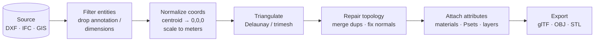

# Geometry Mesh Conversion for CAD/GIS/BIM Interoperability Pipelines

Geometry mesh conversion bridges the gap between parametric, boundary-representation (B-rep) models and polygonal mesh formats required for real-time visualization, web delivery, and computational simulation. In AEC and geospatial interoperability pipelines, this transformation is rarely a one-to-one mapping. CAD drawings contain layered polylines, blocks, and hatches; BIM models embed semantic solids with material assignments; GIS datasets rely on coordinate reference systems (CRS) and topological networks. Converting these heterogeneous sources into clean, watertight meshes demands a structured extraction pipeline, rigorous coordinate normalization, and robust triangulation strategies.

This guide outlines a production-tested workflow for geometry mesh conversion using Python, targeting infrastructure platform teams, GIS/CAD integrators, and automation engineers building scalable interoperability systems. For foundational extraction techniques, refer to the broader [Python Parsing & Geometry Extraction](/python-parsing-geometry-extraction/) framework before implementing the mesh-specific patterns below.

## Prerequisites & Environment Configuration

Before deploying a mesh conversion pipeline, ensure your environment supports deterministic geometry processing and handles large coordinate values without floating-point precision loss.

**Required Stack:**
- Python 3.9+ (type hints and `match/case` improve pipeline routing)
- `trimesh>=4.0` (mesh generation, validation, and export)
- `numpy>=1.24` (vectorized coordinate transforms and array slicing)
- `shapely>=2.0` (2D topology validation and polygon simplification)
- `ezdxf>=1.0` (DXF ingestion and entity traversal)
- `ifcopenshell>=0.7` (IFC B-rep extraction and semantic mapping)
- `pyproj>=3.5` (CRS transformation and datum alignment)

**Coordinate System Considerations:**
CAD and BIM files frequently store geometry in local or project-specific coordinates, while GIS and web viewers expect georeferenced or normalized bounds. Always isolate coordinate transformation from mesh generation. Apply CRS shifts or local-to-global scaling *before* triangulation to prevent vertex drift and floating-point artifacts. The [PROJ library](https://proj.org/) provides industry-standard datum transformations that should be applied at the ingestion stage, not during vertex assembly. Additionally, the [Khronos glTF Specification](https://registry.khronos.org/glTF/specs/2.0/glTF-2.0.html) explicitly recommends keeping vertex coordinates within ±10,000 units to maintain precision in GPU buffers.

## Core Workflow Architecture

A reliable geometry mesh conversion pipeline follows a deterministic sequence. Deviating from this order introduces non-manifold edges, inverted normals, or topology collapse during batch processing.



### Source Ingestion & Entity Filtering

The first step isolates geometric primitives from raw files. CAD formats like DXF store visual and non-visual data in the same entity table. You must filter out text, dimensions, and annotation blocks unless they are explicitly mapped to mesh metadata. When parsing DWG/DXF sources, leverage the [ezdxf Deep Dive](/python-parsing-geometry-extraction/ezdxf-deep-dive/) patterns to traverse block references, resolve nested inserts, and extract only `LINE`, `LWPOLYLINE`, and `3DFACE` entities.

For BIM workflows, IFC files contain hierarchical product definitions with explicit geometry representations. Use the [ifcopenshell Workflow](/python-parsing-geometry-extraction/ifcopenshell-workflow/) to extract `IfcShapeRepresentation` objects, resolve boolean operations, and map material layers to mesh face attributes. Discard `IfcAnnotation` and `IfcGrid` entities early to reduce memory overhead.

### Coordinate Normalization & Bounding Box Alignment

Raw coordinates often span kilometers (GIS) or millimeters (CAD), causing catastrophic precision loss when converted to 32-bit floats. Normalize coordinates by translating the geometry centroid to `(0, 0, 0)` and scaling to a target unit system (typically meters). Store the original transformation matrix as metadata for reverse-projection if needed.

When bridging CAD to geospatial outputs, 2D polylines must be projected into a consistent CRS before extrusion or triangulation. See [Converting CAD polylines to GeoJSON](/python-parsing-geometry-extraction/geometry-mesh-conversion/converting-cad-polylines-to-geojson/) for coordinate projection strategies that preserve topological relationships. Always validate that normalized coordinates fall within `[-10000, 10000]` to avoid WebGL rendering artifacts.

### Topology Repair & Triangulation

B-rep solids and CAD surfaces rarely export as ready-to-render triangles. You must convert boundary loops into planar polygons, then triangulate them while preserving edge constraints. Use `trimesh`'s `creation.triangulate_polygon()` for 2D loops, or `scipy.spatial.Delaunay` for point-cloud surfaces. After triangulation, run a repair pass:
1. Merge duplicate vertices within a tolerance (`np.isclose` with `atol=1e-6`)
2. Remove degenerate triangles (area < `1e-9`)
3. Fix inverted normals by aligning with the dominant face orientation
4. Stitch open edges using half-edge data structures or `trimesh.repair.fix_normals()`

### Semantic Attribute Mapping & Export

Meshes for AEC/GIS pipelines require more than vertex arrays. Map material assignments, layer names, and IFC property sets to `trimesh.visual.TextureVisuals` or custom vertex attributes. Export to `glTF` for web delivery, `OBJ` for legacy CAD viewers, or `STL` for simulation. Ensure that material indices align with face arrays and that UV coordinates are generated if texture mapping is required.

## Implementation Patterns & Code Reliability

Production pipelines fail silently when geometry processing lacks defensive programming. Below is a robust, type-hinted pattern that isolates coordinate normalization, triangulation, and validation.

```python
import logging
from typing import List, Optional, Tuple

import numpy as np
import trimesh

logger = logging.getLogger(__name__)

def normalize_coordinates(
    vertices: np.ndarray,
    target_unit: str = "meters",
    max_extent: float = 10000.0
) -> Tuple[np.ndarray, dict]:
    """Translate and scale vertices to prevent floating-point drift.

    Returns the centered/scaled vertices and a transform record describing
    the centroid and uniform scale applied. The transform record is a dict
    (not a ragged ndarray) so it remains safe to serialize and inspect.
    """
    centroid = np.mean(vertices, axis=0)
    translated = vertices - centroid
    extent = np.max(np.abs(translated))
    if extent > max_extent:
        scale = max_extent / extent
        translated = translated * scale
    else:
        scale = 1.0
    return translated, {"centroid": centroid, "scale": float(scale)}

def build_watertight_mesh(
    vertices: np.ndarray,
    faces: List[Tuple[int, int, int]],
    tolerance: float = 1e-6
) -> trimesh.Trimesh:
    """Construct, repair, and validate a mesh."""
    mesh = trimesh.Trimesh(vertices=vertices, faces=faces, process=False)
    mesh.merge_vertices(merge_tex=True, merge_norm=True)
    mesh.remove_degenerate_faces()
    mesh.fix_normals()

    if not mesh.is_watertight:
        # Attempt hole filling for minor gaps
        trimesh.repair.fill_holes(mesh)

    return mesh

def process_geometry_pipeline(
    raw_vertices: np.ndarray,
    raw_faces: List[Tuple[int, int, int]]
) -> Optional[trimesh.Trimesh]:
    try:
        norm_verts, _transform = normalize_coordinates(raw_vertices)
        mesh = build_watertight_mesh(norm_verts, raw_faces)
        if mesh.is_empty or mesh.faces.shape[0] == 0:
            return None
        return mesh
    except Exception as exc:
        # Log and skip corrupted geometry without halting batch jobs
        logger.warning("Skipping corrupted geometry: %s", exc)
        return None
```

Key reliability practices embedded in this pattern:
- **Process=False on initialization**: Prevents `trimesh` from auto-merging vertices prematurely, preserving original topology for manual repair.
- **Explicit tolerance thresholds**: Avoids arbitrary magic numbers; aligns with CAD precision standards.
- **Graceful degradation**: Returns `None` on failure instead of raising exceptions, enabling async batch processors to queue retries.

## Validation & Quality Assurance

Mesh conversion pipelines require automated validation gates before assets reach downstream consumers. Implement the following checks:

1. **Watertightness**: `mesh.is_watertight` must return `True` for simulation-ready assets. Use `trimesh.repair.fix_winding()` to correct inconsistent face orientations.
2. **Normal Consistency**: Verify that `mesh.face_normals` align with the outward direction using dot-product checks against centroid vectors.
3. **Volume Preservation**: Compare the original B-rep volume (if available) with `mesh.volume`. Deviations > 2% indicate triangulation artifacts or missing faces.
4. **Vertex Count Thresholds**: Enforce upper bounds (`<500k` vertices per mesh) to prevent WebGL memory exhaustion. Apply quadric decimation (`trimesh.simplify_quadric_decimation()`) when limits are exceeded.

Store validation metrics alongside exported files in a sidecar JSON manifest. This enables downstream consumers to filter assets by quality tier without reprocessing.

## Scaling for Production Pipelines

Geometry mesh conversion becomes a bottleneck when processing city-scale BIM models or regional GIS datasets. Scale efficiently using these patterns:

- **Chunked Processing**: Split large assemblies by spatial bounding boxes or IFC story levels. Process each chunk independently, then merge using `trimesh.util.concatenate()`.
- **Memory-Mapped Arrays**: Use `numpy.memmap` for vertex buffers exceeding available RAM. This prevents OOM crashes during batch triangulation.
- **Async I/O with CPU-Heavy Workers**: Offload mesh generation to a process pool (`concurrent.futures.ProcessPoolExecutor`) while keeping I/O asynchronous. Geometry operations are CPU-bound and do not benefit from `asyncio` alone.
- **Caching Intermediate Representations**: Store normalized coordinates and face indices in Parquet or HDF5. Reuse them when switching export formats (e.g., glTF to OBJ) without re-parsing source files.

Monitor pipeline throughput using metrics like vertices-per-second and memory peak. Implement circuit breakers that pause ingestion when validation failure rates exceed 5%, preventing corrupted assets from propagating to web viewers or simulation engines.

## Conclusion

Geometry mesh conversion is a foundational step in modern AEC and geospatial interoperability. By enforcing strict coordinate normalization, applying deterministic triangulation, and embedding validation gates, platform teams can deliver reliable, visualization-ready assets at scale. The patterns outlined here prioritize numerical stability, memory efficiency, and semantic preservation—ensuring that converted meshes remain faithful to their parametric origins while meeting the constraints of real-time rendering and computational workflows.