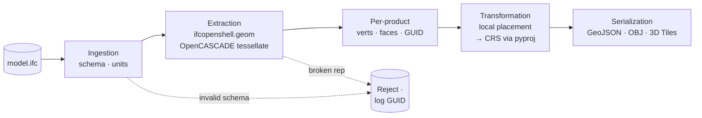

# ifcopenshell Workflow: Building Robust BIM-to-GIS/CAD Pipelines in Python

The **ifcopenshell workflow** has become the de facto standard for programmatic BIM data extraction, enabling infrastructure platform teams to bridge the gap between proprietary authoring tools and open interoperability formats. As AEC tech engineers increasingly demand automated pipelines for CAD/GIS integration, understanding how to reliably parse Industry Foundation Classes (IFC) files using Python is critical. This guide details a production-tested approach to geometry extraction, attribute mapping, and spatial transformation, forming a core component of modern [Python Parsing & Geometry Extraction](/python-parsing-geometry-extraction/) architectures.

## Environment Setup & Dependency Management

Before implementing the pipeline, ensure your runtime environment meets baseline requirements. The `ifcopenshell` library relies on OpenCASCADE for geometry processing and requires Python 3.9 or higher. Install the core dependencies via pip:

```bash
pip install ifcopenshell shapely numpy
```

For large-scale deployments, consider compiling OpenCASCADE with multithreading support (`-DUSE_TBB=ON`) to accelerate mesh generation and boolean operations. Familiarity with the IFC4 schema, particularly the `IfcProduct`, `IfcRepresentation`, and `IfcSpatialStructureElement` hierarchies, is essential. The official [buildingSMART IFC specification](https://standards.buildingsmart.org/IFC/DEV/IFC4_2/FINAL/HTML/) provides comprehensive schema references that should remain open during development.

Additionally, verify that your system has sufficient RAM for geometry compilation. OpenCASCADE allocates native C++ memory that does not automatically return to the Python garbage collector. For files exceeding 500MB, configure swap space or implement subprocess isolation to prevent heap fragmentation.

## Core Pipeline Architecture

A robust ifcopenshell workflow follows a deterministic sequence: ingestion, validation, entity filtering, geometry decomposition, coordinate alignment, and serialization. Unlike lightweight CAD formats, IFC files embed both semantic metadata and parametric geometry, requiring careful handling of representation contexts. The pipeline must gracefully handle missing geometry, multiple coordinate reference systems (CRS), and schema variations (IFC2x3 vs. IFC4).

The architecture should separate concerns into distinct modules:
1. **Ingestion Layer**: Handles file I/O, schema validation, and unit normalization.
2. **Extraction Layer**: Compiles parametric representations into triangulated meshes using OpenCASCADE.
3. **Transformation Layer**: Applies local placement matrices, scales units, and projects to target CRS.
4. **Serialization Layer**: Exports to GeoJSON, OBJ, or 3D Tiles for downstream consumption.



When integrating with mixed-format environments, note that the same extraction logic can be adapted for [ezdxf Deep Dive](/python-parsing-geometry-extraction/ezdxf-deep-dive/) operations or extended with [pydwg Integration](/python-parsing-geometry-extraction/pydwg-integration/) to support legacy AutoCAD formats. Maintaining a unified abstraction layer across these formats prevents vendor lock-in and simplifies CI/CD testing.

## Geometry Extraction & Mesh Generation

Geometry extraction is the most computationally intensive phase. IFC stores geometry parametrically (e.g., extruded profiles, swept solids, boolean operations), which must be tessellated into discrete meshes for GIS/CAD consumption. The `ifcopenshell.geom` module provides a high-level API for this task.

```python
import ifcopenshell
import ifcopenshell.geom
import numpy as np

def extract_product_geometry(ifc_file, product, settings=None):
    """
    Safely extract and triangulate geometry for a single IfcProduct.
    Returns vertices and face indices, or None if geometry is missing/invalid.
    """
    if settings is None:
        settings = ifcopenshell.geom.settings()
        settings.set(settings.USE_PYTHON_OPENCASCADE, True)
        settings.set(settings.INCLUDE_CURVES, False)
        settings.set(settings.EXCLUDE_SOLIDS_AND_SURFACES, False)
        settings.set(settings.SEW_SHELLS, True)

    try:
        shape = ifcopenshell.geom.create_shape(settings, product)
        verts = np.array(shape.geometry.verts, dtype=np.float32).reshape(-1, 3)
        faces = np.array(shape.geometry.faces, dtype=np.int32).reshape(-1, 3)
        return verts, faces
    except RuntimeError as e:
        # Log and skip products with broken representations
        print(f"Geometry extraction failed for {product.Name}: {e}")
        return None
```

Key configuration flags dictate performance and output quality:
- `USE_PYTHON_OPENCASCADE`: Enables native C++ acceleration. Disable only for debugging.
- `SEW_SHELLS`: Ensures watertight meshes, critical for GIS topology validation.
- `INCLUDE_CURVES`: Set to `False` unless your pipeline explicitly requires 2D line work.

For spatial analysis and planar footprint generation, converting extracted meshes to Shapely geometries is highly recommended. Refer to our dedicated guide on [Extracting IFC wall geometries to Shapely](/python-parsing-geometry-extraction/ifcopenshell-workflow/extracting-ifc-wall-geometries-to-shapely/) for optimized projection and polygonization routines.

## Coordinate Transformation & Spatial Alignment

IFC files use local coordinate systems defined by `IfcLocalPlacement` matrices. GIS platforms, however, require georeferenced coordinates (e.g., EPSG:4326 or EPSG:3857). Misaligned coordinates are the most common failure point in BIM-to-GIS pipelines.

The transformation process involves three steps:
1. **Extract the transformation matrix** from the product's `ObjectPlacement` attribute.
2. **Apply unit scaling** (IFC defaults to meters, but authoring tools sometimes export in millimeters).
3. **Project to the target CRS** using `pyproj` or `shapely.ops.transform`.

```python
import numpy as np
import pyproj

def transform_to_crs(verts, matrix, source_crs="EPSG:32633", target_crs="EPSG:4326"):
    """Apply local placement matrix and project vertices to target CRS."""
    # Apply 4x4 transformation matrix to vertices
    homogeneous = np.hstack([verts, np.ones((verts.shape[0], 1))])
    transformed = (matrix @ homogeneous.T).T[:, :3]

    # Project using pyproj
    transformer = pyproj.Transformer.from_crs(source_crs, target_crs, always_xy=True)
    x, y, z = transformer.transform(transformed[:, 0], transformed[:, 1], transformed[:, 2])
    return np.column_stack([x, y, z])
```

Always validate the `IfcProject`'s `UnitsInContext` and `GeometricRepresentationContext` before applying transformations. The [ifcopenshell official documentation](https://docs.ifcopenshell.org/) provides detailed examples for parsing project-level spatial references and handling nested placement hierarchies.

## Serialization & Downstream Integration

Once geometry is extracted and aligned, serialization bridges the gap between Python memory and external systems. Choose the format based on downstream requirements:

- **GeoJSON**: Ideal for web mapping and lightweight spatial queries. Store attributes in the `properties` dictionary and flatten nested IFC property sets using `ifcopenshell.util.element.get_psets()`.
- **OBJ/GLTF**: Preferred for 3D visualization engines and CAD interoperability. Ensure normals are recalculated after transformation.
- **3D Tiles / Cesium**: Required for large-scale infrastructure visualization. Batch geometries by spatial hierarchy (`IfcBuildingStorey`, `IfcBuilding`) and generate `tileset.json` metadata.

When exporting, explicitly close file handles and clear OpenCASCADE shape caches. Python's reference counting does not immediately free native C++ allocations, which can cause memory leaks in long-running services.

## Memory Management & Production Hardening

OpenCASCADE's native heap does not cooperate with Python's garbage collector. In production environments processing hundreds of IFC files, unmanaged memory accumulation will trigger `MemoryError` or OOM kills. Implement these hardening strategies:

1. **Subprocess Isolation**: Spawn a dedicated worker process per file using `multiprocessing`. Terminate the process after serialization to force OS-level memory reclamation.
2. **Explicit Resource Cleanup**: Call `ifcopenshell.geom.clear_shape_cache()` after each batch. Avoid global `settings` objects; instantiate them per extraction call.
3. **Chunked Processing**: For monolithic IFC files (>1GB), parse the file tree first, extract spatial hierarchies, and process `IfcBuildingStorey` or `IfcZone` chunks sequentially.
4. **Async Batch Processing Patterns**: Combine `asyncio` with process pools to maximize I/O throughput while keeping CPU-bound geometry tasks isolated. Our Async Batch Processing Patterns cluster details queue management and backpressure handling.

Monitor native memory usage using `tracemalloc` or `psutil`. If heap fragmentation persists, consider pre-allocating a fixed-size memory pool for vertex arrays using `numpy.memmap` to bypass Python's dynamic allocation overhead.

## Conclusion

The ifcopenshell workflow transforms opaque BIM deliverables into structured, geospatially aware datasets ready for modern infrastructure platforms. By enforcing strict separation of ingestion, extraction, transformation, and serialization layers, teams can build resilient pipelines that scale across project lifecycles. Prioritize explicit memory management, validate coordinate systems early, and leverage Shapely for spatial operations to maintain pipeline reliability. As AEC interoperability standards evolve, this architecture provides a future-proof foundation for automated CAD/GIS integration.