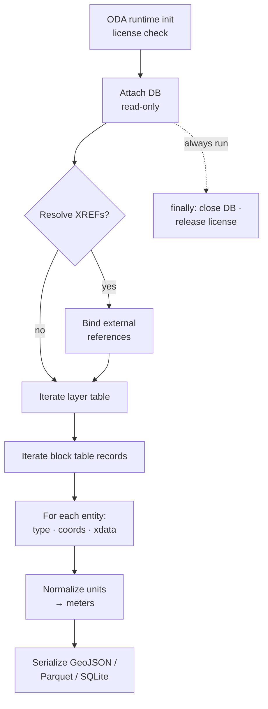

# pydwg Integration: Building Reliable CAD-to-Python Pipelines

DWG remains the de facto standard for architectural, engineering, and construction (AEC) deliverables, yet its proprietary binary structure has historically complicated programmatic access in open-source ecosystems. `pydwg` integration bridges this gap by exposing Open Design Alliance (ODA) Teigha capabilities through Python bindings. For infrastructure platform teams, GIS/CAD integrators, and automation builders, this enables deterministic extraction of vector geometry, layer hierarchies, and entity attributes without relying on manual exports or commercial desktop applications. When architected correctly, `pydwg` integration becomes a foundational component of broader [Python Parsing & Geometry Extraction](/python-parsing-geometry-extraction/) strategies, feeding clean spatial data into downstream BIM validation, mesh generation, or geospatial transformation pipelines.

## Understanding the DWG Parsing Landscape

Unlike open, text-based formats, DWG files store data in a tightly packed, version-specific binary schema. Direct parsing requires navigating block tables, layer dictionaries, and entity streams while respecting ODA's licensing constraints. The primary advantage of leveraging `pydwg` over custom reverse-engineering efforts is access to ODA's officially maintained Teigha kernel, which guarantees version compatibility, accurate curve approximation, and robust handling of complex entities like dynamic blocks, external references (XREFs), and annotative scaling.

However, this capability comes with strict operational requirements. The library is not a pure-Python implementation; it acts as a C-extension wrapper around compiled ODA binaries. This architecture demands careful memory management, explicit resource cleanup, and strict adherence to single-database threading models. Misconfigured deployments frequently result in silent geometry corruption, license server exhaustion, or segmentation faults during high-throughput batch operations.

## Prerequisites & Environment Configuration

Before implementing `pydwg`, establish a controlled runtime environment. The library depends on ODA’s proprietary C++ SDK, which requires a valid developer license or enterprise subscription. Python 3.9 or later is strongly recommended due to improved C-API stability, native type hinting, and consistent memory management across minor releases.

System-level dependencies include the Microsoft Visual C++ Redistributable (Windows) or equivalent GCC/Clang toolchain (Linux), alongside ODA’s runtime libraries (`TD_Dwg`, `TD_Ge`, `TD_Db`, `TD_Root`). Because `pydwg` is not distributed via PyPI, teams typically compile bindings from source using CMake or deploy prebuilt wheels provided by ODA partners. Always verify that your deployment environment matches the architecture (x64/ARM64) of the compiled ODA binaries to prevent `ImportError` or initialization crashes.

Coordinate reference system (CRS) awareness is equally critical. DWG files store geometry in arbitrary local drawing units, requiring explicit transformation matrices when aligning with GIS datasets. Consult the [Open Design Alliance Developer Documentation](https://www.opendesign.com/) for version-specific binary compatibility matrices and licensing guidelines.

## Core Workflow Architecture

A production-grade pipeline follows a deterministic, memory-conscious sequence. The workflow begins with license validation and file initialization, proceeds through hierarchical entity traversal, and concludes with structured serialization. Unlike open formats that expose raw XML or text streams, DWG requires a database-level read approach where entities are accessed through a block table record iterator.



### 1. License & Runtime Initialization
Load the ODA environment and verify license tokens before instantiating any database objects. This step must occur exactly once per process lifecycle to avoid license server throttling. Implement a singleton or module-level guard to prevent redundant initialization during concurrent task execution.

### 2. Database Attachment & Read-Only Locking
Open the target `.dwg` file in read-only mode to prevent file locking conflicts during concurrent batch operations. Use explicit `try/finally` blocks or context managers to guarantee file handles are released even if parsing fails mid-stream.

### 3. Hierarchical Entity Traversal
Query the layer table and block table to establish spatial hierarchies. This step is where most extraction logic resides. For detailed implementation patterns on isolating specific entity types and resolving nested block definitions, refer to our guide on [Parsing DWG layers with Python scripts](/python-parsing-geometry-extraction/pydwg-integration/parsing-dwg-layers-with-python-scripts/). Always resolve XREF paths before traversing, as unresolved references will silently drop geometry from the output.

### 4. Structured Serialization & Export
Convert extracted entities into a neutral, query-friendly format (GeoJSON, Parquet, or SQLite). Normalize units to meters, strip non-spatial metadata unless explicitly required, and apply topology validation before committing to downstream storage.

## Production-Grade Implementation Patterns

Reliable `pydwg` integration requires defensive programming. The following pattern demonstrates safe initialization, deterministic traversal, and guaranteed resource cleanup using Python’s standard library.

```python
import contextlib
import logging
from typing import Any, Dict, List

# `load_oda_database` is provided by your ODA Teigha wrapper module
# (commercial SDK or equivalent). Replace this import with the actual
# binding from your environment — the call shape below is illustrative.
from oda_sdk import load_oda_database  # type: ignore[import-not-found]

logger = logging.getLogger(__name__)

@contextlib.contextmanager
def safe_dwg_session(dwg_path: str):
    """Context manager ensuring proper ODA DB attachment and cleanup."""
    db = None
    try:
        db = load_oda_database(dwg_path, read_only=True)
        yield db
    except Exception as e:
        logger.error(f"DWG parsing failed for {dwg_path}: {e}")
        raise
    finally:
        if db is not None:
            db.close()
            db = None

def extract_layer_geometry(db) -> List[Dict[str, Any]]:
    """Deterministic extraction of vector entities grouped by layer."""
    geometry_buffer = []
    layer_table = db.get_layer_table()
    
    for layer in layer_table:
        if layer.is_frozen or layer.is_off:
            continue
            
        block_records = db.get_block_table().get_layer_records(layer.name)
        for record in block_records:
            for entity in record.entities:
                geometry_buffer.append({
                    "layer": layer.name,
                    "type": entity.type_name,
                    "coordinates": entity.get_coordinates(),
                    "properties": entity.xdata
                })
    return geometry_buffer
```

This approach mirrors best practices found in [ezdxf Deep Dive](/python-parsing-geometry-extraction/ezdxf-deep-dive/) implementations, particularly regarding explicit resource scoping and defensive iteration over potentially corrupted entity lists. Note that ODA’s Teigha kernel is not thread-safe at the database level. If your pipeline requires parallel processing, spawn separate OS processes rather than relying on Python threads, and isolate each DWG file to its own process space.

## Downstream Pipeline Integration

Extracted DWG data rarely remains isolated. Infrastructure platforms typically route parsed geometry into validation engines, spatial databases, or 3D mesh generators. When feeding data into openBIM workflows, align your extraction schema with IFC property sets to maintain semantic continuity. Teams adopting [ifcopenshell Workflow](/python-parsing-geometry-extraction/ifcopenshell-workflow/) strategies often use `pydwg` as a pre-processor, converting proprietary CAD layers into standardized IFC-compatible representations before ingestion.

For GIS alignment, apply affine transformations immediately after extraction. DWG files frequently use local coordinate systems (e.g., `0,0` at a project corner). Store the original insertion point, scale factor, and rotation angle in a companion metadata table. This preserves auditability and allows reversible transformations when merging with municipal shapefiles or LiDAR point clouds.

## Performance Optimization & Scaling Strategies

High-volume DWG processing introduces predictable bottlenecks: license contention, memory fragmentation, and I/O saturation. Address these systematically:

1. **License Pooling:** Configure a local license proxy or use ODA’s floating license manager to distribute tokens across worker nodes. Avoid hardcoding license paths; inject them via environment variables.
2. **Memory Chunking:** Process large files in spatial partitions rather than loading entire databases into RAM. Filter entities by bounding box or layer name during traversal to reduce heap allocation.
3. **Async I/O Decoupling:** Separate file reading from geometry parsing. Use `asyncio` or `concurrent.futures` to queue file reads while worker processes handle CPU-bound ODA operations. This prevents thread starvation and maximizes disk throughput.
4. **Garbage Collection Tuning:** Disable Python’s automatic GC during tight parsing loops (`gc.disable()`), then manually trigger collection after each batch. This reduces pause times caused by cyclic reference checks in C-extension memory pools.

Monitor pipeline health using structured logging and metric counters (e.g., `entities_parsed_per_second`, `license_wait_time_ms`, `db_close_failures`). Alert on non-zero failure rates, as silent ODA exceptions often indicate version mismatches or corrupted DWG headers.

## Conclusion

`pydwg` integration transforms proprietary CAD archives into programmable spatial assets, but its reliability hinges on disciplined environment configuration, explicit resource management, and pipeline-aware architecture. By treating DWG parsing as a deterministic database operation rather than a simple file read, engineering teams can scale extraction across enterprise portfolios without compromising data fidelity or system stability. When combined with standardized downstream routing and rigorous error handling, this approach establishes a repeatable foundation for automated AEC data pipelines, GIS synchronization, and computational design workflows.